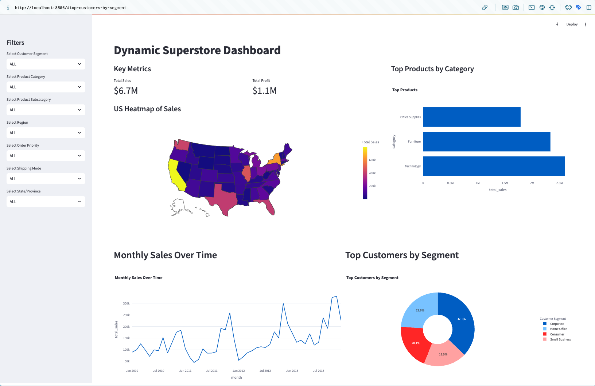

# Dynamic Superstore Dashboard

This project is a comprehensive dashboard created using **Streamlit** and **Plotly**, backed by a **PostgreSQL** database. It visualizes key sales insights, customer behaviors, and product trends to provide a holistic overview of business performance.

---

## Features

### Visualizations
1. **Key Metrics**:  
   Displays:
   - Total Sales (formatted as shorthand, e.g., `$6.7M`)
   - Total Profit (formatted as shorthand, e.g., `$1.1M`)

2. **US Heatmap of Sales**:  
   An interactive choropleth heatmap showing sales distribution across US states.

3. **Top Products by Category**:  
   A horizontal bar chart showcasing the highest-performing product categories.

4. **Monthly Sales Over Time**:  
   A line chart illustrating sales trends over time, enabling seasonal and yearly analysis.

5. **Top Customers by Segment**:  
   A pie chart visualizing customer segments contributing to the total sales.

### Interactive Filters
- The dashboard includes a sidebar with filters for:
  - Customer Segment
  - Product Category and Subcategory
  - Region
  - Order Priority
  - Shipping Mode
  - State/Province  
  These filters dynamically update the visualizations.

---

## Data Preparation

### Steps Involved
1. **Data Cleaning and Transformation**:
   - Raw data from an Excel file was cleaned and transformed using a **Jupyter Notebook**.
   - Ensured data consistency and adherence to the schema requirements of the PostgreSQL database.
   - Applied **UUIDs** for primary keys to ensure unique identification of each record.
   - Addressed missing values, standardized formats, and verified relationships between entities.

2. **Data Loading**:
   - The cleaned data was uploaded to PostgreSQL tables.
   - The data preparation notebook automates this process.

---

## Database Design

### ER Diagram

### Key Features of the Database:
- **Schema Overview**:
  - Entities include `Customer`, `Product`, `Order`, `Sales`, `Shipping`, and `Address`.
- **Primary Keys**:
  - Each table uses **UUIDs** for unique and consistent record identification.
- **Relationships**:
  - Proper foreign key relationships ensure data integrity.
  - E.g., `Order` links customers, products, and shipping details.

### Tables in the Database:
- **Customer**: Stores customer details (e.g., segment, name, address).
- **Order**: Connects customers with their orders.
- **Sales**: Tracks sales details (e.g., profit, sales, discounts).
- **Product**: Contains product details (e.g., category, subcategory).
- **Shipping**: Stores shipping information (e.g., cost, mode).
- **Address**: Captures regional details of customers and shipments.

---

## Technologies Used

- **Frontend**:
  - [Streamlit](https://streamlit.io/) for interactive dashboard development.
  - [Plotly](https://plotly.com/) for advanced visualizations.

- **Backend**:
  - [PostgreSQL](https://www.postgresql.org/) as the database.

- **Data Preparation**:
  - Jupyter Notebook with Python libraries such as `pandas` and `numpy`.

---

## Visualizations in the Dashboard

---

## Getting Started

### Prerequisites

- Python 3.9+
- PostgreSQL
- Libraries: `streamlit`, `pandas`, `plotly`, `sqlalchemy`, `altair`, `numpy`, `psycopg2`

### Setup Instructions

1. Clone this repository.
2. Install dependencies: `pip install -r requirements.txt`.
3. Update database credentials in `config.py`.
4. Run the data preparation notebook (`Data Preparation.ipynb`) to clean and load the data into the database.
5. Launch the Streamlit app: `streamlit run app.py`.

---

## Credits

- Dashboard developed by Dipanshu Kakshapati.
- Data preparation and database schema desigined by Dipanshu Kakshapati.
